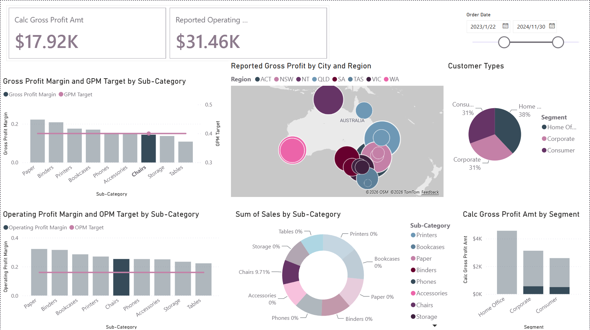

# Retail Profitability Dashboard (Power BI)



Which product sub-categories, regions and customer segments are missing their gross-margin and operating-margin targets?

## Result

[RESULT NEEDED: the only artefact is a screenshot captured with the Chairs sub-category cross-highlighted, so the KPI cards ($17.92K gross profit; $31.46K on the second card, whose title is cut off) and the sales-mix donut (eight labels at 0 per cent) show a filtered state. Supply the unfiltered gross profit, operating profit and the number of sub-categories below the 40 per cent gross-margin target, or replace the screenshot with a clean capture.]

Readable as captured: order dates 22 January 2023 to 30 November 2024; nine sub-categories, eight Australian regions and three customer segments (Home Office 38 per cent, Corporate 31, Consumer 31).

## Data

Course-provided retail transaction dataset with order date, city and region (ACT to WA), product sub-category, customer segment, sales, gross profit and operating profit. Row count and full date range are not recorded here. The data and the .pbix that embeds it are course-licensed and not redistributed; one screenshot is published.

## Method

- A DAX measure layer computes gross profit, operating profit, both margin ratios and fixed target measures (gross-margin target 0.40, operating-margin target about 0.16), so each margin visual plots actual against target.
- One report page with eight visuals and a date slicer: two KPI cards, two combo charts of margin versus target by sub-category, a map of gross profit by city and region, a sales-mix donut, a customer-type pie and gross profit by segment.
- All visuals cross-highlight: selecting a region, sub-category or segment filters the page.

## Limitations

- The screenshot was taken with a selection active, which is why most donut labels read 0 per cent and the cards do not show an unfiltered total.
- The gross-margin chart plots bars and the target line on different axes, so bars appear closer to target than they are.
- The second card ($31.46K) exceeds gross profit ($17.92K), which standard definitions do not allow; the measures need checking before the numbers are quoted.
- No .pbix, data or DAX is published, so nothing can be verified beyond the image.

## Reproduce

Not reproducible from this repository. Open figures/overview.png to inspect the page; the .pbix can be shown on request.

## Repo contents

```
retail-profitability-dashboard-powerbi/
├── README.md
├── .gitignore
└── figures/
    └── overview.png
```
